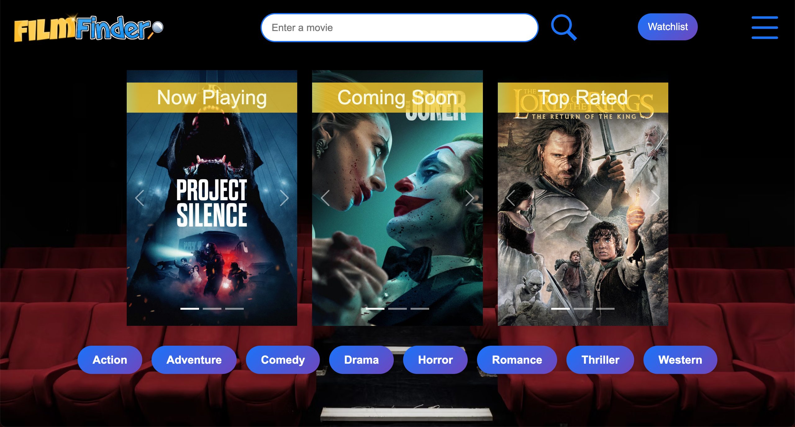
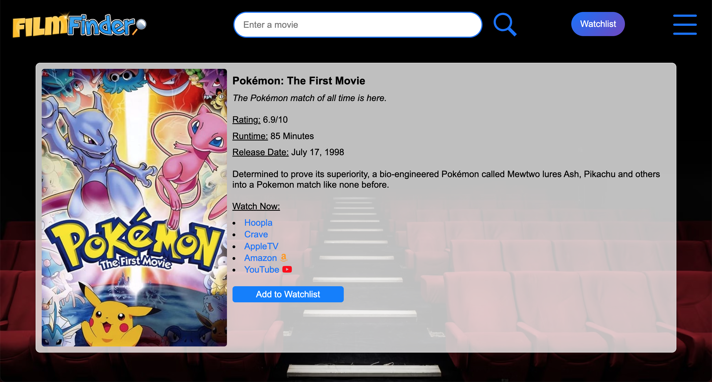
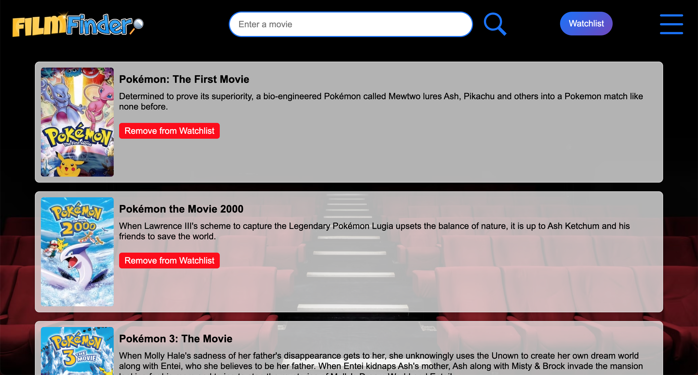

# FilmFinder
*A movie discovery platform integrating TMDb and Watchmode APIs to help users find films, access streaming information, and maintain personal watchlists*

## Built With
[](https://developer.mozilla.org/en-US/docs/Web/HTML)
[](https://developer.mozilla.org/en-US/docs/Web/CSS)
[](https://developer.mozilla.org/en-US/docs/Web/JavaScript)
[](https://getbootstrap.com/)
[](https://developer.themoviedb.org/reference/intro/getting-started)
[](https://api.watchmode.com/docs/)

## Table of Contents
- [Description](#description)
  - [Deployed Site](#deployed-site)
- [Features](#features)
- [Screenshots](#screenshots)
- [Technical Details](#technical-details)
- [Installation](#installation)
- [Usage](#usage)
- [Contributing](#contributing)
- [Developers](#developers)
- [Credits](#credits)
- [License](#license)

## Description
FilmFinder is a comprehensive movie discovery platform that combines multiple API integrations to create an immersive movie browsing experience. Built with TMDb and Watchmode APIs, this project demonstrates effective API implementation while providing users with a powerful tool for exploring and tracking movies.

The application draws inspiration from the traditional movie theatre experience, featuring engaging movie poster carousels and intuitive genre navigation. By combining detailed movie information with streaming platform availability, FilmFinder helps users make informed decisions about what to watch and where to find it. The personalized watchlist feature, powered by local storage, ensures a seamless experience by allowing users to maintain and manage their movie selections across sessions.

### Deployed Site
Visit the live website at: [https://kyoriku.github.io/FilmFinder/](https://kyoriku.github.io/FilmFinder/)

## Features
* **Movie Search & Discovery**
  * Real-time search using TMDb API with dynamic results display
  * Genre filtering across eight categories (Action, Adventure, Comedy, etc.)
  * Three-carousel showcase for Now Playing, Coming Soon, and Top Rated movies
  * Detailed movie information including ratings, release dates, and descriptions
  * Direct links to individual movie detail pages

* **API Integration**
  * TMDb API integration for movie data and search functionality
  * Watchmode API integration for streaming platform availability
  * Multiple endpoint utilization (now_playing, upcoming, top_rated, search)
  * Error handling with user feedback
  * Poster image path handling and display

* **Watchlist Management**
  * Add/remove functionality with duplicate prevention
  * Persistent storage using localStorage
  * Individual movie removal capability
  * Quick access to movie details from watchlist
  * Automatic UI updates on watchlist changes

* **User Interface**
  * Bootstrap-powered responsive layout
  * Dynamic content loading and display
  * Interactive movie cards with hover effects
  * Unified navigation system with dropdown menu
  * Cross-browser compatibility

## Screenshots





## Technical Details
This movie platform was built using the following technologies and features:

* **API Integration**: Multiple API endpoint management:
   * TMDb API endpoints for movies, search, and genres
   * Watchmode API for streaming availability data
   * `fetch` API with async/await for data retrieval
   * JSON response parsing and error handling
   * Proper API key management and URL construction

* **jQuery Implementation**: Extensive use of jQuery for DOM operations:
   * `$(document).ready()` for initialization
   * Event delegation with `.on()` method
   * Dynamic element creation using jQuery selectors
   * Chain-based DOM manipulation
   * AJAX requests for API calls

* **Local Storage Management**: Browser storage implementation:
   * `localStorage` for watchlist persistence
   * JSON serialization/deserialization for data storage
   * Duplicate entry prevention logic
   * Storage cleanup on item removal
   * Error handling for storage operations

* **Event Handling System**: Comprehensive event management:
   * Form submission handling for search
   * Click events for genre filters
   * Keyboard event handling for search
   * Document-level event delegation
   * Movie card interaction events

* **Bootstrap Components**: Framework integration:
   * Carousel implementation for movie showcases
   * Responsive grid system for layout
   * Navigation components
   * Modal system for detailed views
   * Custom styling extensions

* **Dynamic Content Generation**: Structured content creation:
   * Template-based movie card generation
   * Dynamic URL construction for movie details
   * Poster path handling and image loading
   * Error state handling
   * Loading state management

## Installation
To run this project locally:

1. Clone the repository
    ```bash
    git clone https://github.com/kyoriku/FilmFinder.git
    ```
2. Obtain API keys from:
   * [TMDb](https://developer.themoviedb.org/reference/intro/getting-started)
   * [Watchmode](https://api.watchmode.com/docs/)
3. Add your API keys to the configuration
4. Open `index.html` in your preferred web browser

## Usage
1. Use the search bar to find specific movies
2. Click genre buttons to filter movies by category
3. Click on movie cards to view detailed information
4. Add movies to your watchlist using the "Add to Watchlist" button
5. Access your watchlist to view saved movies
6. Remove movies from your watchlist as needed

## Contributing
Contributions are welcome! Here are ways you can help:

1. Fork the repository
2. Create a feature branch
    ```bash
    git checkout -b feature/YourFeature
    ```
3. Make your changes - this could include:
    * Adding new features
    * Improving the UI/UX
    * Optimizing API calls
    * Enhancing search functionality
    * Bug fixes
4. Commit your changes
5. Push to your branch
6. Open a Pull Request

Please ensure your contributions:
* Follow the existing code style
* Include appropriate error handling
* Test all changes locally
* Include clear descriptions in your pull request

## Developers
* [waltscode](https://github.com/waltscode)
* [Samm1911](https://github.com/Samm1911)
* [Matthew-Beaubien](https://github.com/Matthew-Beaubien)
* [kyoriku](https://github.com/kyoriku)

## Credits
Built with knowledge from the following resources:

* **APIs**
  * [TMDb API Documentation](https://developer.themoviedb.org/reference/intro/getting-started)
  * [Watchmode API Documentation](https://api.watchmode.com/docs/#api-reference)

* **Additional Resources**
  * [Font Awesome Icons](https://fontawesome.com/icons)
  * [Bootstrap Documentation](https://getbootstrap.com/docs/)

## License
[](https://opensource.org/licenses/MIT)

This project is licensed under the [MIT](https://opensource.org/licenses/MIT) license - see the LICENSE file for details.